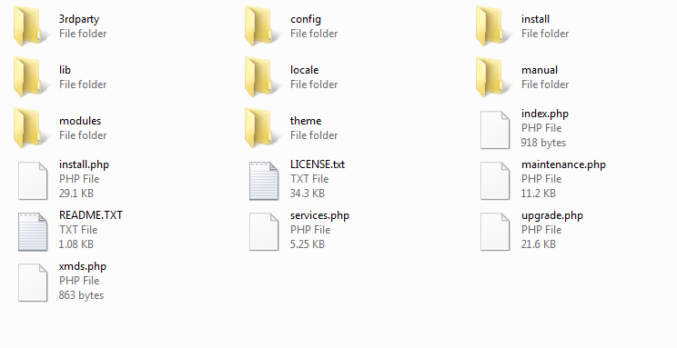

<!--toc=getting_started-->
#CMS Installation
**Content Management System**
The [[PRODUCTNAME]] CMS is a PHP web application which sits on a MySQL database. The PHP / MySQL combination is very popular as a web platform and can be run on Linux or Windows servers.

We have provided some basic instructions for installing your own web server [here](install_environment.html).

## Installation
Beyond this point we assume you have a web server running with PHP and MySQL and that you have the compressed archive (ZIP or Tarball) of the CMS installation package.

The screen shots and instructions below assume a windows installation - however the same is true for Linux.

The basic process is as follows:
1. Download and extract the archive
2. Starting the Installation
3. Pre-requisites
4. Creating the database
5. Database details
6. Starting the Installation
7. Final Configuration
8. Complete

###Download and extract the archive
The CMS archive contains a sub folder called [[PRODUCTNAME]]-server-1.7.0-beta, copy this folder into your web root and rename as necessary. In the simplest of web server configurations the name of this folder will be the name of the URL you use to access the CMS. For example: `http://localhost/your target folder name`

At this point we should also make a folder for the CMS library. This will be used to store images, videos and other file based media that is uploaded to the CMS. Once created make a note of the path as the CMS installation will require this information.

###Starting the Installation
Now open your web browser (Mozilla Firefox, Internet Explorer etc). In the address bar, enter `http://localhost/your target folder name`. You should see the [[PRODUCTNAME]] Installer start screen. Click "Next".

###Pre-requisites
The installer contains a detailed check list of all the items required for a successful installation. Each item will have either:

* A tick - the item is present and correct
* An exclamation mark - the item is present but may not be configured correctly.
* A cross - the item is missing.

Any items with an exclamation mark or a cross should be addressed and the retest button used to run this step again.

The most common problems here are missing PHP modules, configuration of PHP settings and file permissions issues to the library.

Once all the items are ticked press next to advance.

###Creating the database
The CMS can install into a new database, or an existing one. We recommend a new database.

[[PRODUCTNAME]] does not prefix its table names and may conflict with content in an existing database.

###Database Details
Whether you chose an existing database or a new one, the installer will need to collect some information about that database to allow the CMS to connect, read and write.

The installer will need the following information:

**Host**
The host name for your MySQL installation - in the majority of cases this will be "localhost".

**Admin Username**
The "root" user name for your MySQL installation. This is only used for the installation and is only required if you have asked the installer to create a new database.

**Admin Password**
The "root" password. This is only used for the installation and is only required if you have asked the installer to create a new database.

**Database Name**
The name for the CMS database.

**Database User name**
The user name for the CMS to use to connect to the database - usually this can be the same.

**Database Password**
The password to use to connect to the database.

###Start the Installation
The installer will now create / populate database for [[PRODUCTNAME]]. You should see a series of dots appear on the screen as this happens. It can take a few moments to complete. Assuming everything went well, click "Next".

_If there are errors at this point, please see the troubleshooting section of this manual._

###Admin Password
Now we need to choose a password for the PRODUCTNAME_admin user. This is the first user in the [[PRODUCTNAME]] system, and is the person who typically administers [[PRODUCTNAME]](does updgrades etc). Choose a password for the user and enter it in both boxes.

_Make a note "[[PRODUCTNAME]] Admin: Username: [[PRODUCTNAME]]_admin Password:" and then the password that you chose. You'll need this to log on, and to perform upgrades at a later date._

Assuming the password you chose was acceptable, you'll be told the password change succeeded. Click Next.

###Settings
The next screen deals with configuring [[PRODUCTNAME]]. The first box asks for the location that [[PRODUCTNAME]] should store the media you upload. We created a folder for this earlier and wrote it down. Enter the directory you wrote down next to "Library Directory", e.g "c:\[[PRODUCTNAME]]Library".

The next box asks for a server key. You can think of this as a password for adding client PCs to the system. Choose something obscure. You won't have to enter this very often. Make a note on your piece of paper. You'll need to refer to this when installing the client.

The final tick box asks if it's OK to send anonymous statistics back to the [[PRODUCTNAME]] project. There's information on exactly what we collect is available here. If you're happy for that to happen, tick the box. Otherwise, un-tick it. Click "Next".

###Complete
And we're done. You should be presented with a link to log in to your new [[PRODUCTNAME]] system. Click the link and log in with your [[PRODUCTNAME]]_admin user name and password.