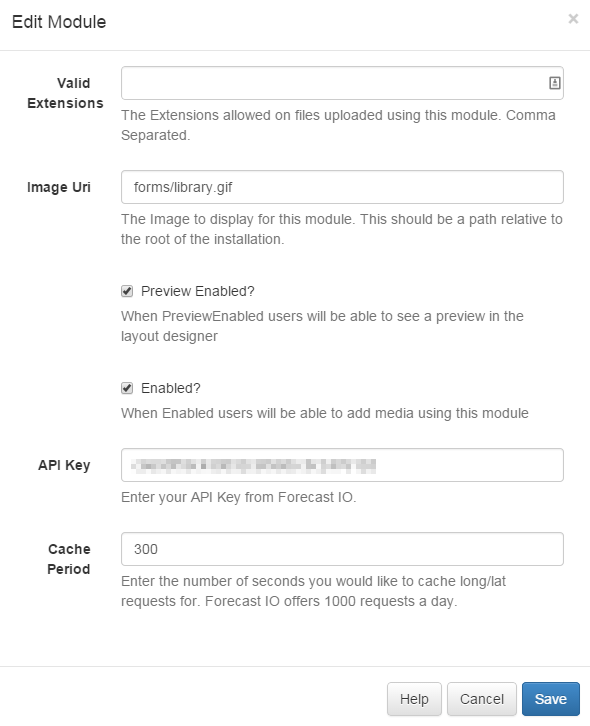
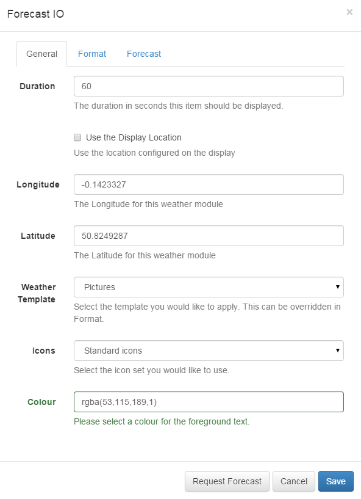

<!--toc=media-->
# Weather
The [[PRODUCTNAME]] weather widget provides current and daily weather forecasts worldwide. It uses the [Forecast API](https://developer.forecast.io/) and needs to be authenticated before use.

## Installation
The module comes pre-installed on all 1.7 installations, but needs an API key from [Forecast](https://developer.forecast.io/) to function correctly.

This configuration is entered in the Module Administration page by Editing the "Forecast IO" module.

There are two settings required:
1. API Key
2. Cache Period

### API Key
The API key is obtained after [registering an application](https://developer.forecast.io/) on the Forecast developer website.

The API Key identifies the [[PRODUCTNAME]] CMS with Forecast and allows the CMS access to the weather data.

### Cache Period
Forecast allow 1000 requests for a forecast per day before charging a small fee for each subsequent request.

The CMS allows a cache period to be specified which will create a delay between requests for each geographic location.

## Adding to a Layout
Weather data can be added to any layout and configured to use either a provided latitude / longitude, or the displays latitude / longitude. If the displays latitude / longitude is selected the default global location will be used in the preview.

The module will also ask for a template - there are 3 provided with the application.

- Current Day
    
    The current days weather and temperature.

- Daily
    
    A 7 day forecast with a summary for each day.

- Pictures

    More detailed "picture" icons.

### Request a Forecast
It is possible to "request a forecast" at any time to see what forecast data is returned. Any field is available as a substitute in the template by entering the field name between square brackets - for example [nearestStormDistance].

## Editing the default templates
Selecting a template on the General tab will automatically load that templates structure and presentation in the Format tab.

These can be edited and saved with each Layout.

There are 3 sections that need to be provided:
1. Current Template

    This is also known as the "main" template as it is used for the current weather conditions and as the basis for the repeating daily template.

2. Daily Template

    This is the repeating template that should be provided for the 7 day forecast. It will be repeated for each day and then substituted into the special [dailyForecast] tag (which should feature on the main template).

3. CSS
    
    This is the CSS to apply to the template structure above. It will be augmented with a colour attribute and has a special [[ICONS]] which will be replaced with the selected icon sprite (see section below).

The template will be automatically scaled and should be designed for the intended output resolution.

**Reload Template**

There is also a button to reload the template from the original. This should be done each time the original template is changed (it won't happen automatically in-case customisations have been made already).

### Extending with new icons
New icons can be added by a system administrator who has access to the file system. Any PNG file in `modules/theme/forecastio/weather_icons` will be made available for selection in the Icons selector.

Weather icons are provided as a sprite, each icon is 128x128 and should represent the same weather conditions as the shipped icon sprite.

For example, a "clear-day" is represented by the icon in position 1, a "windy day" is represented by the icon in position 11.