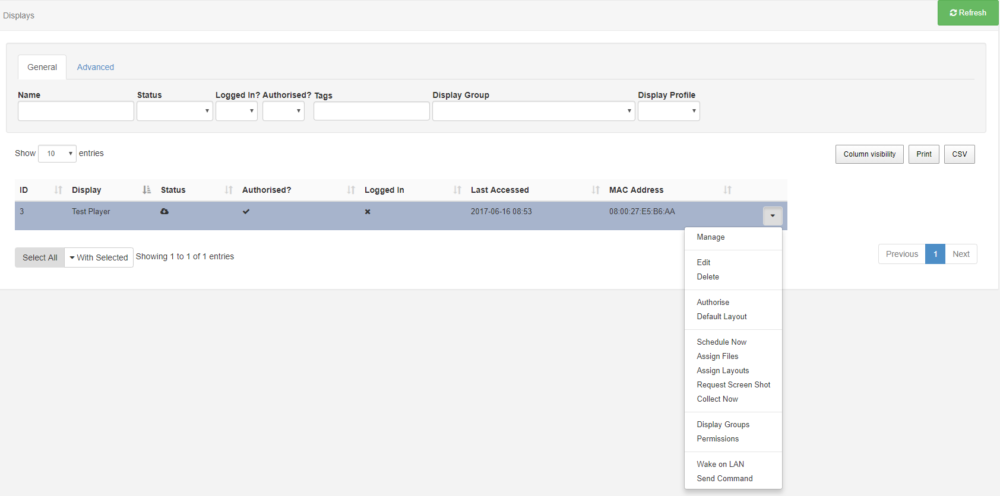
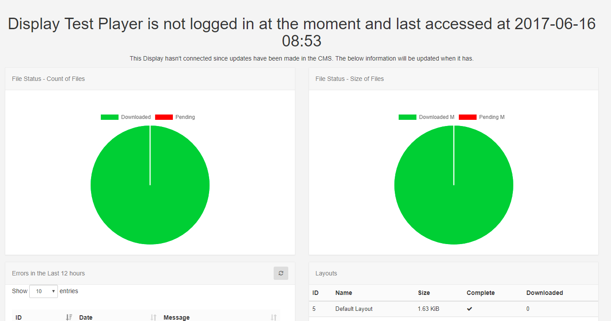

<!--toc=displays-->

# Displays

The primary purpose of [[PRODUCTNAME]] is to show content on screens with the entire application suite existing for that one purpose. [[PRODUCTNAME]] provides a concept called **Displays** to manage when and how content is shown on a screen.

{tip}
When no other content is Scheduled, Displays will **always** show a **Default Layout**. You can create your own Default Layout to replace the existing one to show.
{/tip}

Displays are uniquely identified by a **hardware key** which is generated when the Signage Player software is installed. This hardware key is used to create a Display record in the CMS and is unique to that one Display record.

## Connecting a Display

Displays connect to the CMS over an API called "XMDS" {nonwhite}(Xibo Media Distribution Service){/nonwhite}. Each Signage Player software application will have its own method of registering and connecting to the CMS - most of them only require the `URL` and `CMS Key`.

{tip}
New Displays will need to be marked as **authorised** before they can be sent any content. This can be done by using the row menu for the Display and clicking **Authorise**.
{/tip}

## Display Administration

Displays are administered from the Menu, with logged in Users able to view the status of Displays that they have been assigned permission for.

#### ID

Used for internal identification of the display.

#### Display

Name given to the Display for easy identification purposes (this is not shown on the Display itself).

#### Status

*Tick* = Player is up to date (this may also show as green in colour).

*Cloud icon* = Player has not logged in with content waiting to be downloaded (this may also show as amber in colour, as displayed in the example image above).

*Cross* = Player is currently downloading new content and has yet to complete (this may also show as red in colour).

#### Authorised

Tick or cross to indicate whether the Display has been granted a licence with the CMS. This prevents unauthorised Displays being added to the CMS.

#### Logged In

Tick or cross to show if the Display has logged in recently.

#### Last Accessed

Date and time stamp of when the Display was last accessed. 

#### MAC Address

Media Access Control Address of the Display (if the client software is capable of sending it).

{tip}
Columns can be toggled on and off to show the information you would like to display for administration purposes by clicking on the **Column visibility** button. 
{/tip}

### Row Menu

Each Display has a row menu containing a number of actions that can be performed against them such as;

#### Manage

Each Display has its own Dashboard which shows the Displays current status, bandwidth usage, file status and errors.

{tip}
This Dashboard is useful as a first step for troubleshooting issues with a Display.
{/tip}

#### Edit

Configure options specific to that Display with the 'Advanced' tab, which lists the general settings applied from the selected **Settings Profile**.

#### Delete

Deleting a Display will remove it from the CMS entirely - this operation cannot be reversed. A deleted Display can be reconnected to the CMS by repeating the “Register” procedure which will create a new unique Display record.

{tip}
Deauthorise a Display instead of deleting so that it can be re-authorised at a later date if needed. Use the row menu for the Display and click on Authorise to toggle to Deauthorise. This can also be actioned from the **Edit Display** form by selecting **No** for Authorise display.
{/tip}

#### Send Command

The **Send Command** functionality is executed via XMR to Players by selecting a predefined command. This is useful for sending Players 'Reboot' commands for example.

{tip}
Administrators create predefined commands for use, therefore if you require additional commands, please contact your Administrator.
{/tip}

{tip}
This type of Command can also be executed by scheduling a [Command Event](scheduling.html#Events)
{/tip}