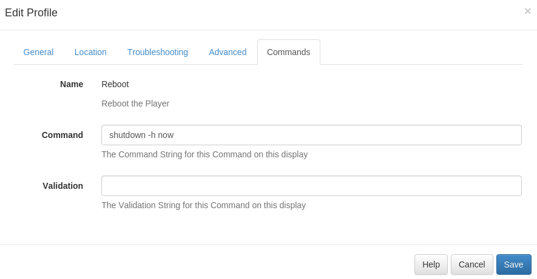

<!--toc=displays-->
# Commands
The commands functionality in [[PRODUCTNAME]] is used to configure a set of predefined commands which can have a different
 command string per player. This is particularly useful if the network of players is mixed between Windows/Android or even
 if the players are slightly different hardware or connected to different displays.

A command record is created with a name, description and unique command code. The command string is then entered on a
 display settings profile. All displays with that profile will then use the command string whenever they are asked to
 execute a particular command.

This 2-stage approach means that the same commands can be scheduled across multiple
 player types (be they different operating systems, have difference LCD panels connected, etc).

Commands also provide easy access to functionality such as RS232, Android Intents, etc.

## Configuring a command
Commands are initially created on the **Commands** page in the CMS.


The usual CMS functionality to add/edit and delete commands is provided.

All commands are then presented on the Display Profile Edit form under the Commands tab:



For each command a *command* and *validation* can be specified.

#### Command
The command string represents the final executed command and can be a direct call to the shell or can have a *helper*
 specified. See below.

#### Validation
The validation string is used as a comparison to the command output and if it matches then the command is considered a
 success. This string can be a regular expression.

## Scheduling
Commands can be scheduled using the standard Schedule Page by selecting the *command* event type when adding/editing a
 schedule.

Scheduled commands are executed once on the Player and only require a From Date.
 The command can be executed up to 10 seconds after the from date selected.

## Use on Shell Commands
Commands can be selected when adding a Shell Command Widget to a Layout. Shell
 Commands with a Command as their source act in the same fashion as normal
 shell commands. They should usually be used in a region on their own so they
 are executed only once each time the Layout is shown.

<a id="helpers"></a>
## Helpers
Command Helpers are prefixes that can be added to the command string in order to
 take a more advanced action. Commands without a prefix are executed in the
 shell of the operating system which runs the Player. `cmd.exe` on Windows and
 `shell` on Android.

#### RS232
RS232 commands can be executed on Players by using the `rs232` prefix in
 the command string. The format of the command is `rs232|<connection string>|<command>`.

The connection string should be provided in the following format on Windows:

```bash
<COM#>,<Baud Rate>,<Data Bits>,<Parity|None,Odd,Even,Mark,Space>,<StopBits|None,One,Two,OnePointFive>,<Handshake|None,XOnXOff,RequestToSend,RequestToSendXOnXOff>
```

The connection string should be provided in the following format on Android:

> TODO: Provide Android Connection String Format

The command itself is a string which gets sent over RS232 using the connection
 details.

#### Android Intents
Android display profiles can use the `intent` helper to specify an intent that should be called when the command executes.
 The format of the command is `intent|<activity>|[<extras>]`.

Commands containing an intent helper are ignored in the Windows Player.

## HDMI-CEC
HDMI-CEC is a bus that is implemented on nearly all new large screen TVs that have HDMI connectors. This bus (which
 is physically connected within normal HDMI cables) supports control signals that can perform power-on, power off,
 volume adjust, selection of video source and many of the features that are accessible via the TV's remote control. It can
 also control most other hardware on the HDMI bus.

[[PRODUCTNAME]] doesn't provide a direct interface to HDMI-CEC as there are many different manufacturer specifications, however
 it is possible to control HDMI-CEC via a batch file.
