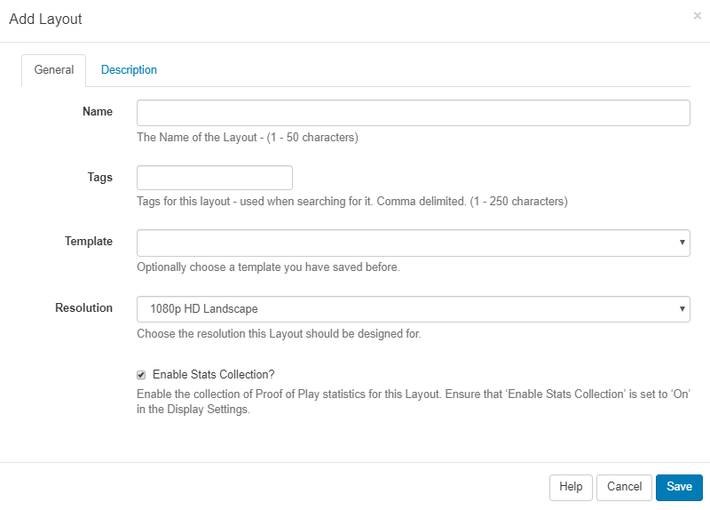

<!--toc=layouts-->

# Layouts

A Layout is a complete screen design including content and background, which is then Scheduled to a Display or multiple Displays. A Layout is made up of 1 or more Regions which hold content and contain Playlists of Media to show. Media is assigned to Playlists using Widgets which provide the actions for the selected Module. 

<tip>
Take a look at the [Modules](media_modules.html) page to see the variety of content available by simply adding a Widget to a Layout.
</tip>

[[PRODUCTNAME]] has no limit to the number of Layouts you can have in the system or the number a User can have.

Layouts are administered from the Design section of the menu. Click on **Layouts** to open the Layouts grid to view all existing Layouts and to create new from the **Add Layout** button.

## Add Layout

Click on the action button to open the Add Layout form to complete the fields.

<tip>

**When should a User create a new Layout? When should a User add to an existing Layout?**
Layouts provide vast flexibility in the system, but can also cause confusion. The recommended usage for a Layout is to only contain the design and Media required for a set of related content that should be Scheduled at the same time.

**Scenario**:
You have a video showing a fire safety demonstration and a video showing an advert for an upcoming production - it would be natural to have separate Layouts for these.

</tip>

### Tags

Layouts can be tagged which allows for ordering and makes it easier to find and view a large number of Layouts if grouped by a certain Tag. This is particularly useful with a growing number of Layouts.

### Templates

Create Layouts and save your design to use as a [Template](layouts_templates.html), great for maintaining a corporate image or style.

### Resolution

Layouts are designed for an intended Display resolution and will function best when shown on a Signage Player with a matching Resolution. If they are shown on a Display that has a different Resolution it will dynamically resize which may result in  unused screen space.  

<tip>
Sending a client a Layout that has been designed with a 4:3 Resolution which is connected to a 16:9 TV screen would result in two empty bars either side of your content. 
</tip>

**If you require an alternative Resolution to the available options listed contact your Administrator**

## Row menu

Use the row menu for a selected Layout to access more options:

### Design

Make changes to your existing Layout designs by clicking on **Design**. This will return you to the Layout Designer screen so that you can make edits. 

### Preview Layout

See how your design will playout. The Layout will open in a separate window in your browser and play from start to finish. This allows you to make important adjustments to ensure that your Layouts play as intended.

<tip>

Before the Layout can start all Media must be downloaded to your browser and verified so you may experience a slight delay whilst this is in process.
</tip>

### Schedule Now

To save time, Layouts can be Scheduled for a specified amount of time, which can be very useful for important notices/promotions.

### Assign to Campaign

Select Layouts to include in your created Campaigns.

### Edit

Make changes to the naming and Tags used for the Layout as well as make changes to the Background image/colour.

### Copy

Create copies of Layouts, which can also include all contained Media items, to use as a base for creating new Layouts and save time.

### Retire

Retire a Layout  so it does not affect existing Schedules. A retired Layout will be hidden from new Scheduling options but will remain unaffected in existing Schedules.

### Delete

Remove a Layout completely from all existing Schedules (this action is irreversible)

### Export

Export the Layout including all associated Widgets/Media/DataSet structures to a ZIP file, so it can be shared easily.

### Permissions

Assign Permissions to choose Users/User Groups who should have access to View Edit and Delete the Layout.

<tip>

Did you know….Layouts and Library files can be [Assigned](displays_fileassociations.html) directly to a Display or Display Group so that they are always available in the local library of the Player. Useful for pre-loading a Layout ahead of time ready to be Scheduled.

</tip>