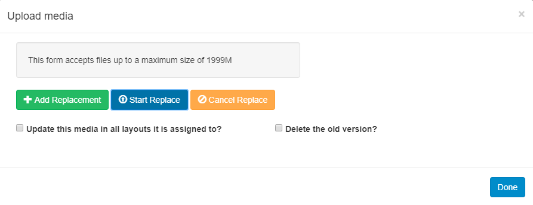
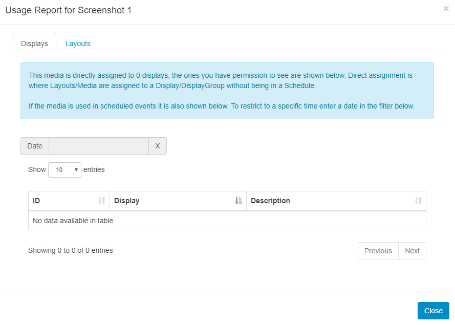

<!--toc=media-->

# Library 

The CMS Library stores all file-based Media that is uploaded for use on Layouts.

## Uploading Media

Library Media can be uploaded directly to the Library using an easy to use file upload tool.

Navigate to the Media page under the Library section of the Menu to open the Library grid, and click on the **Add Media** button.

<tip>
Media can also be uploaded directly to a Module assigned in a Layout, which will also save to the Library by default.
</tip>

Uploading is achieved in two steps.

1. Click **Add files** and select the file(s) you wish to upload.
2. Click **Start upload** to begin the transfer of all files, alternatively click on the blue upload button next to individual files to upload individually. Once successfully uploaded, click Done.

<tip>
Files can also be added via drag and drop.
</tip>

## Adding New Fonts

[[PRODUCTNAME]] comes with a set of standard fonts provided by our text editor tool - CKEditor. New fonts can be added and uploaded to the Library in the same way. Once added the font will be available to use in the text editor.

<tip>
If the new font does not show in the text editor after upload, try clearing the browser cache.
</tip>

## Row Menu

Each Media item has a Row menu with a list of actions that can be performed against it.

### Edit

The Edit Media form allows you to edit the name and duration of the file as well as options to Retire and Update edits to Layouts that contain the current Media file.

It may be necessary to upload a new revision of an existing file. This can be done by using the **Replace** button at the bottom of the form.

Upload a replacement file using the same steps as before and select whether the replacement file should be updated to all Layouts it is assigned to and remove the old version.

<tip>
Media files can also be edited directly from the Layout that they are assigned to by editing the Playlist Widget, including replacing Media files.
</tip>

### Delete

Media files can only be deleted from the CMS if they are not being used on any existing Layouts. There is an option to force a delete from any existing Layouts which must be used with caution, deleting a file cannot be reversed.

<tip>
Retiring content means that it will no longer be available to assign to new Layouts but will remain in existing Layouts it is assigned to, meaning Scheduled content can remain unaffected.
</tip>

### Permissions

Assign **View/Edit/Delete** permissions for User/User Groups.

### Download

Download a copy of the Media file for easy of sharing.

### Usage Report

This will show if the selected Media file is scheduled to Displays. Use the Layout tab to see what Layouts the file is currently being used in.

<tip>
The Usage Report is great to make checks prior to deleting files.
</tip>