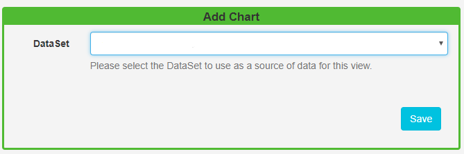
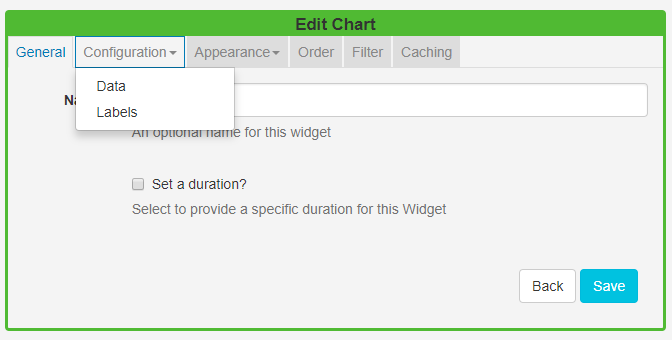
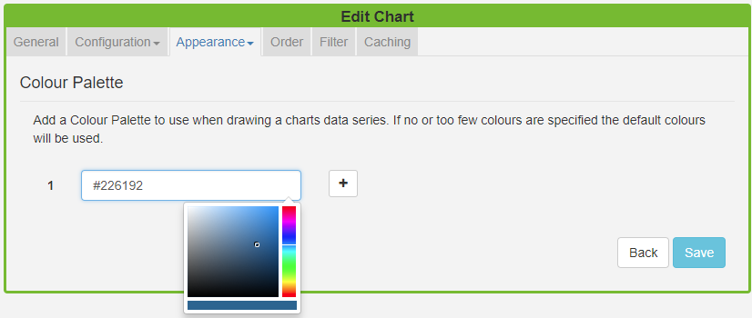

<!--toc=widgets-->

# Chart

The Chart module is used in conjunction with **DataSets** to display information as one of the following Chart Types:

- Line
- Bar
- Pie
- Donut
- Horizontal Bar
- Radar

DataSets are created and defined in the Library and can be represented in Layouts using the Chart module. For more information on DataSets and how they are configured, please see the [DataSet manual page](media_datasets.html).

Click on the **Chart Widget** on the toolbar,  add / drag to the target **Region**.  

{tip}
If you are using 1.8, select **Chart** from the Widget Toolbox to add to your Region Timeline and complete the form fields as explained below. 
{/tip}

## Add Chart

Use the drop-down menu to select the DataSet to be used as the source.

### General

- Provide an optional name.
- Choose to override the default duration.

### Configuration

#### Data

- Use the drop down to select the **Chart type** which would best present information held in the selected DataSet.
- All types of chart need an X and Y axis configured from the available columns in the associated DataSet. Configure by using the selectors.

{tip}
Include a Series Identifier if you want to show a breakdown of values rather than the sum of all values. 
A series identifier is not suitable for Pie/Donut charts.
{/tip}

#### Labels

- Include a chart title and labelling to display on the chart. 
- Choose to include a **Legend** to further explain the data.

### Appearance

#### Style

Use the colour picker to select colouring for the **background** and **font** for the chart as well as specifying the **font size**.

#### Colour Palette

Use the colour picker to select the colours to use for the charts data series. If you do not select any colours the default colouring for the module will be used (these can be configured in Module Settings by your administrator)

### Order

DataSet results can be ordered by any **column**. Use the advanced order clause for more complex ordering by providing a SQL command.

### Filter

DataSet results can be filtered by any **column**.
Include or omit DataSet results using the clause builder or use the advanced filter clause for more complex filtering.

### Caching

Include a suitable time for the **Update Interval** in minutes, keeping it as high as possible. This determines how often the Module will request data from your feed. 

{nonwhite}

Take a look at the [Chart Module Guide](https://community.xibo.org.uk/t/chart-module-guide-xibo-cms-1-8-10/14794) to walk you through how you can produce a Layout to include a Chart.

{/nonwhite}