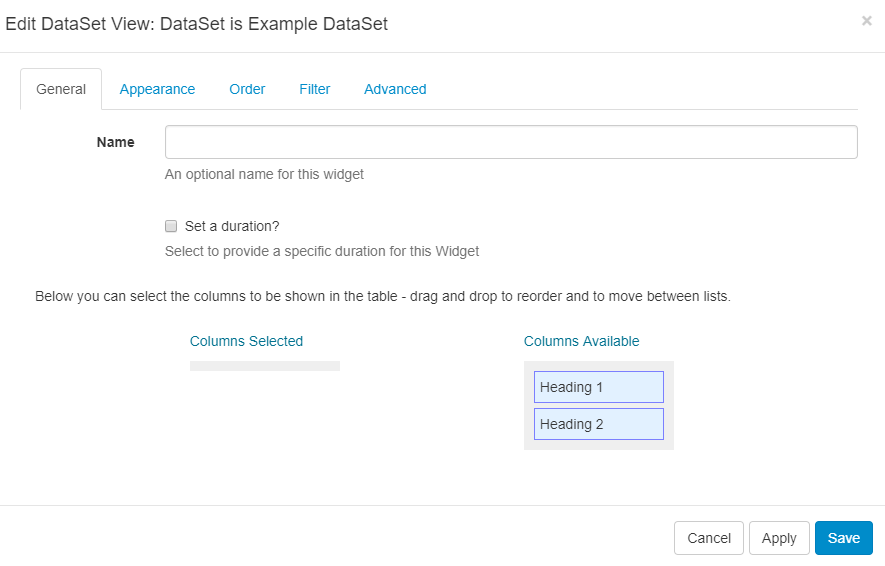

<!--toc=widgets-->
# DataSet Views

The DataSet View Module allows content from a created DataSet to be added into a **Region**, organised and displayed in a tabular fashion.

When the underlying DataSet Data is changed, the DataSet View Widget included in your Layout(s), will automatically update with the new Data.
{tip}
Once a DataSet has been added to a DataSet View, care should be taken when editing the Column structure of the DataSet.
{/tip}

## Adding a DataSet View

Ensure that you have created a [DataSet](media_datasets.html) prior to adding a DataSet View.

Select the **DataSet** to use as the source of data from the drop-down menu. On saving, a new form will open to provide further options.


{tip}
You cannot change to a different DataSet once it has been added to a DataSet View. To use an alternative DataSet a **new** DataSet View would need to be created.

{/tip}

## Edit DataSet View

Complete the form fields for each tab header.



#### General

- Give an optional name.
- Set a duration to override the default if required.
- Use drag and drop to select available columns.

#### Appearance

Complete the form fields to style your DataSet View. Override the template to use a **CSS style sheet** to control the visual styling of the Table. (Example style sheet at the bottom of this page).

#### Order

Order by any column using the clause builder or by providing a SQL command for more complex ordering.

#### Filter

Filter by any column using the clause builder to only include/omit results based on chosen criteria. Provide a SQL command for more complex filtering.

#### Advanced

Set Lower and Upper row limits (0 = unlimited).

Enter an update interval in minutes, kept as high as possible. (Displays can cache the content of this Media type to prevent repeated download of identical resources, as well as for off-line playback).

Split the data over multiple pages using **Rows per Page**. 

{tip}

Use the text editor to ensure that a message is displayed when no data is returned from the source to prevent an ‘empty screen’!

{/tip}

## Example Style Sheet

``` css
table.DataSetTable {
font-family:"Trebuchet MS", Arial, Helvetica, sans-serif;  
width:100%;
border-collapse:collapse;
}

tr.HeaderRow {
font-size:1.1em;
text-align:center;
padding-top:5px;
padding-bottom:4px;
background-color:#A7C942;
color:#ffffff;
}

tr#row_1 {
color:#000000;
background-color:#EAF2D3;
}

td#col_1 {
color:#000000;
background-color:#EAF2D3;
}

td.DataSetColumn {
color:#000000;
background-color:#EAF2D3;
border:1px solid #98bf21
}

tr.DataSetRow {
text-align:center;
color:#000000;
background-color:#EAF2D3;
border:1px solid #98bf21
padding-top:5px;
padding-bottom:4px;
}

th.DataSetColumnHeaderCell {
font-size:1em;
border:1px solid #98bf21;
padding:3px 7px 2px 7px;
}

span#1_1 {

}

span.DataSetColumnSpan {

}
```


