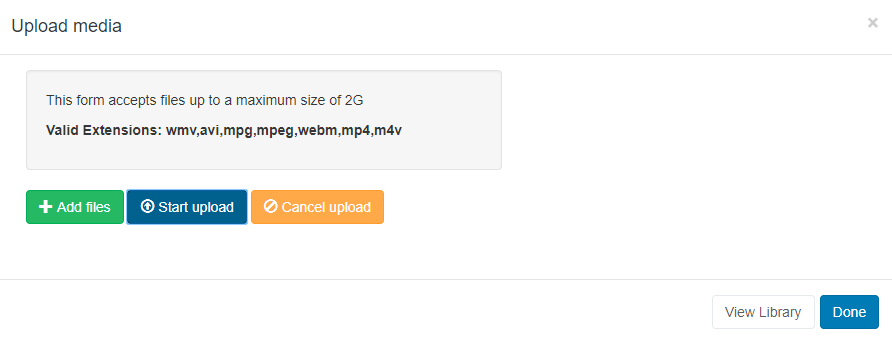
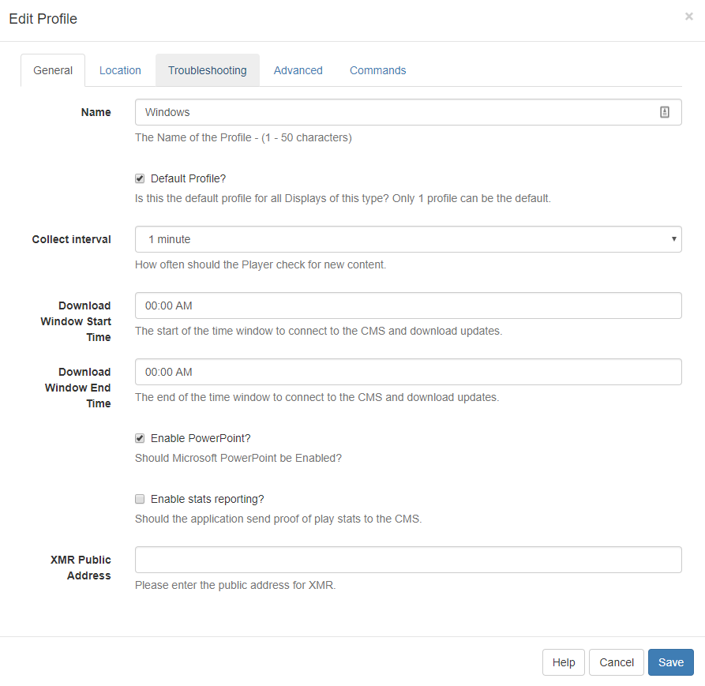

<!--toc=widgets-->

# PowerPoint

[[PRODUCTNAME]] has 2 options to display PowerPoint PPT files.

**Option 1 -** Exported as a Video for non-Windows Players, and or, have no full copy of PowerPoint to install.

**Option 2 -** Prepared and Uploaded as a PowerPoint PPT file for Windows Players only. Requires a full copy of PowerPoint to install on each Windows Player.

{tip}
If the PowerPoint PPT file has already been uploaded to the Library use the [Library Search](layouts_library_search.html) tab to quickly and simply add to a Region.
{/tip}

## Option 1 - Export as a Video

From Office 2010 onwards PowerPoint presentations can be exported as **Video files** which can then be uploaded to [[PRODUCTNAME]] and played using the Video Widget.

### Export PowerPoint

- Export a PowerPoint by using the option on the file menu from inside the PowerPoint application. Save the file with an appropriate name to be selected for upload.

{tip}

If your Players are Android or webOS devices you should ensure that the export format is MP4 (PowerPoint 2013 onwards) or convert your video to a MP4 using a 3rd party tool.

{/tip}

### Upload Video

{tip}
If you are using 1.8, select **Video** from the Widget Toolbox to add to your Region Timeline.
{/tip}

- Click on the  [Video Widget](media_module_video.html) on the toolbar, add / drag to the target **Region**. 
- Click on **Add files** and select the exported PowerPoint file to upload.



Once assigned to a Region, **Edit** options are available.

## Option 2 - Prepare and Upload your PowerPoint PPT file

PowerPoint is a proprietary format from Microsoft and can only be displayed on a Windows-based signage player which has Microsoft PowerPoint installed.

First prepare the PowerPoint Presentation. PowerPoint will, by default, put scroll bars up the side of your presentation, unless you do the following for each PowerPoint file *BEFORE* you upload it:

1. Open your PowerPoint Document
2. Slide Show -> Set-up Show
3. Under "Show Type", choose "Browsed by an individual (window)" and then untick "Show scrollbar"
4. Click OK
5. Save the Presentation
6. Note also that [[PRODUCTNAME]] will not advance the slides in a Presentation, so you should record automatic slide timings by going to "Slide Show -> Rehearse Timings" and then saving the presentation.

`<a name="machine_preparation"></a>`

Click on the **PowerPoint Widget** on the toolbar, add / drag to the target **Region**. 

{tip}
If you are using 1.8, select **PowerPoint** from the Widget Toolbox to add to your Region Timeline.
{/tip}

Click on **Add files** to upload to the Library or click on View Library to select an uploaded file.


### Prepare your Windows Players

Install PowerPoint on your Windows PC alongside your [[PRODUCTNAME]] Player and make the following adjustments to the Windows Registry to disable the windows prompt when opening the PowerPoint. **Please ensure you have taken all necessary precautions when making these changes**.

```registry
[HKEY_CLASSES_ROOT\PowerPoint.Show.12]
"BrowserFlags"=dword:00000002
"EditFlags"=dword:00010000

[HKEY_CLASSES_ROOT\PowerPoint.Show.8]
"BrowserFlags"=dword:00000002
"EditFlags"=dword:00010000

[HKEY_CLASSES_ROOT\PowerPoint.SlideShow.12]
"BrowserFlags"=dword:800000a0
"EditFlags"=dword:00010000

[HKEY_CLASSES_ROOT\PowerPoint.SlideShow.8]
"BrowserFlags"=dword:00000002
"EditFlags"=dword:00010000
```

If you do not feel comfortable changing the registry it may be possible to achieve the same results by waiting for [[PRODUCTNAME]] to open the first PowerPoint and then when the pop-up notification appears, choose to "Open" the file, and un-check the box so you won't be prompted again.

### Enable PowerPoint on Displays

You will need to ensure that the Windows Display Profile used for the Displays you intend to use PowerPoint on, must be first enabled.

Navigate to **Display Settings** under the **Displays** section of the Main menu and locate the Windows Display Profile. Use the row menu to edit the profile. On the **General** tab tick the **Enable PowerPoint** check box and **Save**.



### Advanced Steps

When displaying PowerPoint [[PRODUCTNAME]] is relying on Windows and PowerPoint to display the content. This means that error capture and reporting is outside the control of [[PRODUCTNAME]]. To mitigate any issues we recommend disabling Windows error notifications. This can be done by following the [steps here](https://www.lifewire.com/how-do-i-disable-error-reporting-in-windows-2626074). 

If you still experience issues, it may also be advisable to disable Office Application Error reporting by merging the registry patch below.

```reg
[HKEY_CURRENT_USER\Software\Policies\Microsoft\Office\11.0\Common]
"DWNeverUpload"=dword:00000001

[HKEY_CURRENT_USER\Software\Policies\Microsoft\Office\10.0\Common]
"DWNeverUpload"=dword:00000001

[HKEY_CURRENT_USER\Software\Policies\Microsoft\Office\12.0\Common]
"DWNeverUpload"=dword:00000001
```