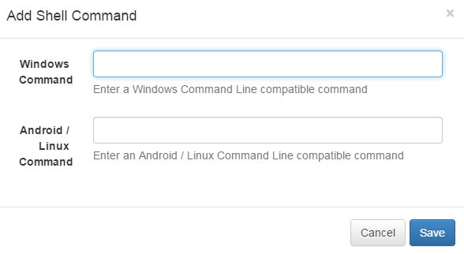

<!--toc=media-->
# Shell Command

The Shell Command module is used to instruct the Display Client to execute a command outside of the [[PRODUCTNAME]] environment, using the operating system shell.

The Shell Command is executed when the Region Timeline item is shown on the Layout. Layouts can be scheduled in order to execute Shell Commands at specific times.

Requires root access on Android - Android uses the Linux command box.

- **Windows Command**
    
    The Shell Command for Windows. Will be executed using `cmd.exe`.

- **Linux Command**
    
    The Shell Command for Linux.

Shell Commands do not have a duration, they are executed once and then expire automatically.

## User Contributed Example Usage

In [[PRODUCTNAME]] client, Shell Command adds ability to control system power management options, and run external commands based
on the layout's activity. This allows a great deal of flexibility in power options on client-side

e.g. you can have a client hibernate and wake up at noon every day to present lunch related signage. Before it hibernates 
it can turn off the TV/Display.

Using shell command, user can create a special template called "turn off display", which can be scheduled to turn off displays.
With [[PRODUCTNAME]] client attached to a display, there is a couple of API calls that can be used to ask ACPI to send calls to the 
video card to trigger monitor power suspension.

HDMI-CEC: This is a bus that is implemented on nearly all new large screen TVs that have HDMI connectors. This bus (which 
is physically connected within normal HDMI cables) supports control signals that can perform power-on, power off, 
volume adjust, selection of video source and many of the features that are accessible via the TV's remote control. It can 
also control most other hardware on the HDMI bus.

In [[PRODUCTNAME]] client, user can disallow power management from timing out the display EXCEPT when the "turn off display" layout is being
used - this covers cases where [[PRODUCTNAME]] is using a regular computer monitor (and Windows already provides power management).

By adding two options to [[PRODUCTNAME]] client i.e. "command to run to turn off display" and "command to run to turn on display". 
These would be used to run custom executables. This would allow full customization of actions on a per-client basis, 
such as running a program to send RS-232 commands, or a batch file that sets a BIOS wakeup timer and then shuts down the system. 
Potentially %parameters% can be made available to the command-line, such as the number of minutes until the next scheduled 
non-"turn off display" template, which would allow full server-side control of these options once the initial set-up is done.

The Windows [SetThreadExecutionState](http://msdn.microsoft.com/en-us/library/aa373233(v=vs.85).aspx) function can be used to prevent display time out. It is designed for apps such as video or presentations, which is exactly what [[PRODUCTNAME]] is.

[[PRODUCTNAME]] client would need to check for transitions between the "turn off display" template and non-"turn off display" templates, and then act appropriately (eg, there is a procedure to run for the transition to "off" and another to run for "on"). At this time, calls to SetThreadExecutionState and any custom commands (if entered) would be run.