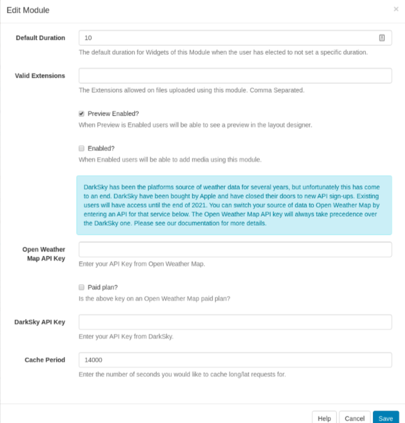
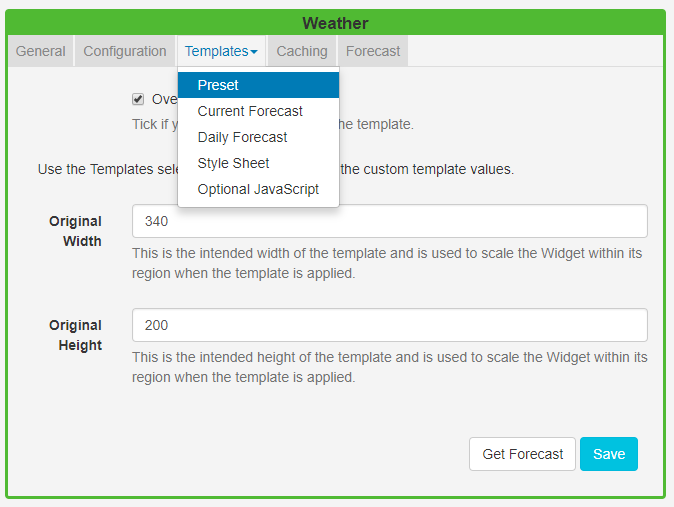

<!--toc=widgets-->

# Weather

The Weather Widget provides current daily weather forecasts worldwide using the [DarkSky API](https://darksky.net/) as a source of weather data.

{nonwhite}
{cloud}

The Weather Module is configured for **Xibo in the Cloud** customers and is provided as part of the service. Please skip the installation steps detailed below and proceed with the set-up at the **Add Weather Widget** section.
{/cloud}

**Non-Xibo in the Cloud customers please follow the installation steps as detailed below.**

{/nonwhite}

## Installation

To get an API key please visit [DarkSky](https://darksky.net) to create an account.

(If you are going to exceed 1000 calls per day you will also need to enter your billing information).

The Weather Module is installed from the Modules page, under the Administration section of the menu. Click on the **Install Module** button and select the Module to install.

After installation,  select the Module from the grid and use the row menu to select **Edit**.

Complete the form fields and include the **API key**. The CMS allows a Cache period to be specified which will create a delay between requests for each geographic location.

DarkSky allows 1000 requests for a forecast, per day before charging a small fee for each subsequent request.

## Add Weather Widget

The DarkSky Terms of Service <https://darksky.net/tos> should be read and understood before using this Widget. 

Click on the **Weather Widget** on the  toolbar, add / drag to the target **Region**. 

{tip}
If you are using 1.8, select **Weather** or **Forecast IO** from the Widget Toolbox to add to your Region Timeline and complete the form fields as explained below.
**Please note:** The Visual editor is not available in the 1.8 series of the CMS for this Widget.
{/tip}

### General

- Provide an optional name
- Choose to override the default duration

### Configuration

- Use the display location for the lat/long recorded on the **Display** rather than specifying manually.
- Select the unit of measurement using the drop-down menu.
- Choose the language to use.
- Use the checkbox to only show daytime weather conditions.

### Templates

Select **Preset** templates or provide your own using JavaScript.

#### Preset

- Use the drop-down to select an appropriate template.
- Tick to edit the selected template. Please see the section on [Editing default templates](media_module_weather.html#editing_default_templates) below for further information.

### Caching

Enter the Update Interval in minutes.

## Attribution

All Layouts that use the Weather Widget need to include the text “Powered by DarkSky” as per the [DarkSky Terms of Service](<https://darksky.net/tos>) . 

## Editing default templates

Default templates can be edited by selecting a template using the drop-down and clicking in the **Override the template** checkbox. 

{tip}
The template will be automatically scaled and should be designed for the intended output resolution. The following guidelines should be considered when editing templates:

- Templates must be designed at a fixed size
- All elements must use absolute sizing in px, including fonts, margins, widths, heights, etc
- If positioning is used, it must be from top,left
- Templates can use bootstrap
- The aspect ratio will be fixed by [[PRODUCTNAME]] and sized to fit the Region
- Templates are treated the same as a static image
  {/tip}

Click again on the **Templates** tab and select to edit:

### Current forecast template

Also known as the **main template** as it is used for the current weather conditions and as the basis for the repeating Daily forecast template.

{tip}
Click on **Get Forecast** to see available substitutions to use.
{/tip}

{tip}
Toggle **On** the Visual editor to use the Inline Editor to provide text and formatting.
{/tip}

### Daily forecast template

This is the **repeating template** that should be provided for the 7 day forecast. It will be repeated each day and then substituted into the special `[dailyForecast]` tag (which should feature on the main template). 

The `[dailyForecast]` tag has 2 optional settings which can be added to the tag by including the`|` character. These are `[dailyForecast|Number of days|Start day]` and default to 7 days, starting at tomorrow (day 2). If you wanted to see the next 3 days you would use [dailyForecast|3]` and for a 3 day forecast starting the day after tomorrow you could use `[dailyForecast|3|3]`.
{tip}  

 A common example is to ignore the "Current Template" and produce a full 7 day forecast using the daily forecast - this is achieved with `[dailyForecast|7|1]`.

{/tip}

### CSS

This is the CSS to apply to the template structure above. It will be augmented with a colour 
attribute and has a special `[[ICONS]]` which will be replaced with a selected icon sprite. 

### Get Forecast

It is possible to **request a forecast** at any time to see what forecast data is returned. Any field is available as a substitute in the template by entering the field name between square 
brackets - for example `[nearestStormDistance]`.

### Extending with new icons

New icons can be added by an Administrator who has access to the file system. Any PNG file in `modules/theme/forecastio/weather_icons` will be made available for selection in the Icons selector.

Weather icons are provided as a sprite, each icon is 128x128 and should represent the same weather conditions as the shipped icon sprite.
{tip}
For example, a "clear-day" is represented by the icon in position 1, a "windy day" is represented by the icon in position 11.

{/tip}

{tip}
You may have a Layout Status `! There are items on this Layout that can only be assessed by the client`This is a normal Layout Status if you have online content which will be assessed on the Player side. 

{/tip}

## Additional Information

[[PRODUCTNAME]] should accept any date format that is in a correct PHP date format, the following characters are recognised and can be used:

| Format Character | Description                                                  | Example returned values                 |
| ---------------- | :----------------------------------------------------------- | --------------------------------------- |
|                  | **Day**                                                      |                                         |
| d                | Day of the month, 2 digits with leading zeros                | 01 to 31                                |
| D                | A textual representation of a day, three  letters            | Mon through Sun                         |
| j                | Day of the month without leading zeros                       | 1 to 31                                 |
| l                | (lowercase ‘L’) A full textual representation of the day of the week | Sunday through Saturday                 |
| N                | ISO-8601 numeric representation of the day of the week (added in PHP 5.1.0) | 1 (for Monday) through 7 (for Sunday)   |
| S                | English ordinal suffix for the day of the month, 2 characters | st, nd, rd or th. Works well with j     |
| w                | Numeric representation of the day of the week                | 0 (for Sunday) through 6 (for Saturday) |
| z                | The day of the year (starting from 0)                        | 0 through 365                           |
|                  | **Week**                                                     |                                         |
| W                | ISO-8601 week number of year, weeks starting on Monday (added in PHP 4.1.0) | 42 (the 42nd week in the year)          |
|                  | **Month**                                                    |                                         |
| F                | A full textual representation of a month, such as January or March | January through December                |
| m                | Numeric representation of a month, with leading zeros        | 01 through 12                           |
| M                | A short textual representation of a month, three letters     | Jan through Dec                         |
| n                | Numeric representation of a month, without leading zeros     | 1 through 12                            |
| t                | Number of days in the given month                            | 28 through 31                           |
|                  | **Year**                                                     |                                         |
| L                | Whether it’s a leap year                                     | 1 if it is a leap year, 0 otherwise.    |
| o                | ISO-8601 year number. This has the same value as Y, except that if the ISO     week number (W) belongs to the previous or next year, that year is used instead. (added in  PHP 5.1.0) | 1999 or 2003                            |
| Y                | A full numeric representation of a year, 4 digits            | 1999 or 2003                            |
| y                | A two digit representation of a year                         | 99 or 0                                 |
|                  | **Time**                                                     |                                         |
| a                | Lowercase Ante meridiem and Post meridiem                    | am or pm                                |
| A                | Uppercase Ante meridiem and Post meridiem                    | AM or PM                                |
| B                | Swatch Internet time                                         | 000 through 999                         |
| g                | 12-hour format of an hour without leading zeros              | 1 through 12                            |
| G                | 24-hour format of an hour without leading zeros              | 0 through 23                            |
| h                | 12-hour format of an hour with leading zeros                 | 01 through 12                           |
| H                | 24-hour format of an hour with leading zeros                 | 00 through 23                           |
| i                | Minutes with leading zeros                                   | 00 to 59                                |
| s                | Seconds, with leading zeros                                  | 00 through 59                           |
| u                | Microseconds (added in PHP 5.2.2). Note that date() will always generate 000000 since it takes an integer parameter, whereas DateTime::format() does support microseconds if DateTime was created with microseconds. | 654321                                  |
|                  | **Timezone**                                                 |                                         |
| e                | Timezone identifier (added in PHP 5.1.0)                     | UTC, GMT, Atlantic/Azores               |
| I                | (capital i) Whether or not the date is in daylight saving time | 1 if Daylight Saving Time, 0 otherwise. |
| O                | Difference to Greenwich time (GMT) in hours                  | +0200                                   |
| P                | Difference to Greenwich time (GMT) with colon between hours and minutes (added in PHP 5.1.3) | +02:00                                  |
| T                | Timezone abbreviation                                        | EST, MDT …                              |
| Z                | Timezone offset in seconds. The offset for timezones west of UTC is always negative, and for those east of UTC is always positive. | -43200 through 50400                    |
|                  | **Full Date/Time**                                           |                                         |
| c                | ISO 8601 date (added in PHP 5)                               | 2004-02-12T15:19:21+00:00               |
| r                | » RFC 2822 formatted date                                    | Thu, 21 Dec 2000 16:01:07 +0200         |

