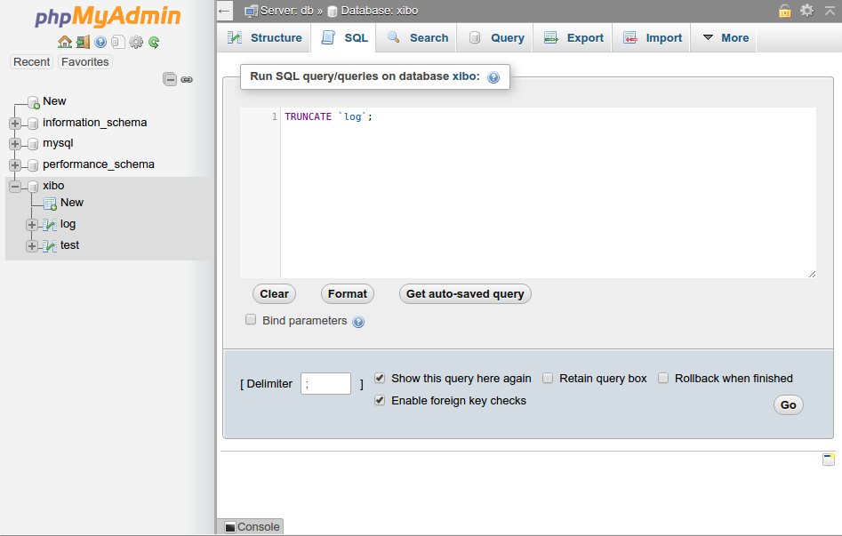
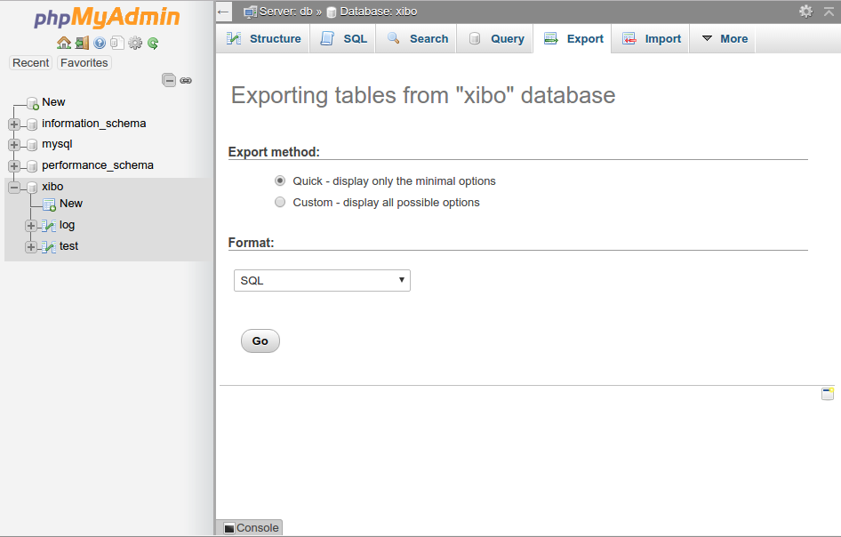

<!--toc=getting_started-->
# Upgrade
The CMS can be upgraded to later versions - we recommend all users upgrade when
possible to take advantage of the latest bug fixes and features.

## Supported upgrades
The CMS can be upgraded from 1.4 to 1.7 and from 1.7 to 1.8. Direct upgrade
 from 1.4, 1.5, 1.6 to 1.8 is not supported.

## Docker installations

Upgrading Docker based installations is easy:

* Take the actions in the [Docker guide](install_cms.html#upgrading_xibo)
* Navigate to login and the upgrade wizard will open and show the list of
upgrade steps.
* Press start to run through them.

## Switching to Docker
Installations prior to 1.8 will be "Custom/Manual" installations and should be migrated
to Docker during the upgrade. Please follow the below instructions:

* Download the Xibo Release Archive and extract it - The archive should be extracted in a 
  suitable location on your host machine - the choice of location is up to you. The only 
  requirement is that the Docker installation can read/write to it.
* In the same directory,
* Make a directory shared
* Make directory shared/backup
* Make directory shared/cms
* Make directory shared/cms/library
* Put the library files from your existing install in to shared/cms/library
* Empty your log table using the CMS Web Portal OR `TRUNCATE log` from a MySQL prompt
* Export your database from your old installation, 
  e.g. `mysqldump -u user -p database-name > import.sql`
* Put your 1.7 (or 1.8) database export in to shared/backup/import.sql

#### Exporting your existing database

The example above uses `mysqldump`, however if your environment does not have `mysqldump`
it is possible to use `phpmyadmin` to generate a backup. Care must be taken to ensure
that a database is selected in the left hand pane **before** going to the export tab. Failure
to do this will result in the export containing the existing database name, which may not 
match the new name in Docker.

Step 1:

Step 2:

## Custom/Manual installations

Upgrading a manual installation happens in 3 stages:

 1. Requirements
 2. Upgrade the CMS files
 3. Upgrade the database

Upgrading the CMS files is a manual process that should be completed by your
 web server administrator. Upgrading the CMS is completed in a wizard and can be
  done by the CMS administrator.

Please check the [release notes](release_notes.html) before starting the upgrade.

### Steps
You should always take a backup before upgrading your CMS Installation.

* If upgrading to 1.8 series, ensure your environment meets the [requirements
for installation](manual_install.html), if it does not then correct that before continuing.
*   *Optionally* clone your existing [[PRODUCTNAME]] database and grant
permissions (see [Clone Database](release_notes_clonedb.html "Clone Database")
for details). It is possible to upgrade without cloning but much harder to roll
back.
*   Backup settings.php from your installation (found in `web/settings.php`)
*   Manually take a backup of your database
*   Replace your existing installation with the new version from the tar.gz or
zip file. **Do not copy over the top.**
*   Replace your backup settings.php file in your [[PRODUCTNAME]] installation
directory
*   Browse to [http://your.server/path](http://your.server/path) as normal
*   Log in as an administrator.
*   The upgrade wizard will open and show the list of upgrade steps.
*   Press start to run through them.
